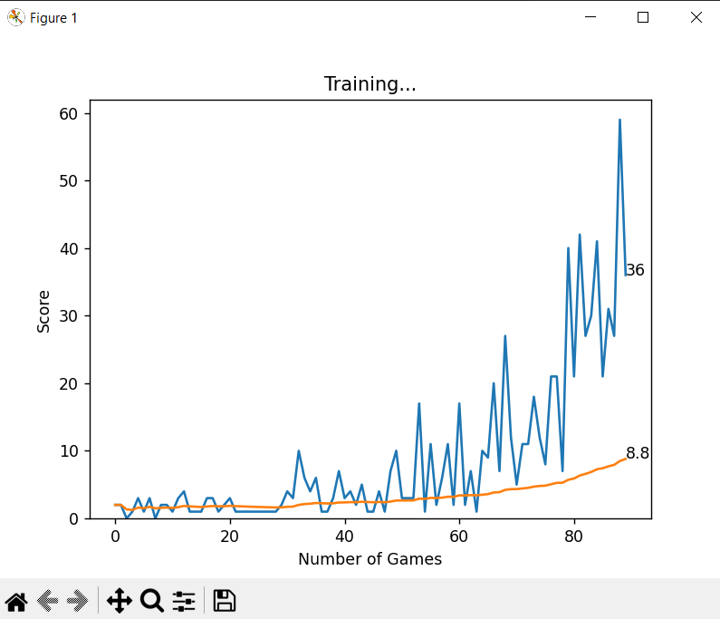

# Snake Game AI with Deep Q-Learning

This project is an implementation of a Snake Game AI using Deep Q-Learning. The AI learns to play the classic Snake game using a neural network and reinforcement learning techniques.

## Table of Contents

- [Overview](#overview)
- [Installation](#installation)
- [Usage](#usage)
- [Project Structure](#project-structure)
- [Agent Details](#agent-details)
- [Model Details](#model-details)
- [Training](#training)
- [Checkpointing and Fine-Tuning](#checkpointing-and-fine-tuning)
- [Logging](#logging)
- [Screenshots](#screenshots)
- [Contributing](#contributing)
- [License](#license)

## Overview

The AI agent is trained to play Snake using a neural network that predicts the best moves based on the current state of the game. The training process utilizes the Q-learning algorithm, where the agent learns from its actions and the rewards received.

## Installation

To run this project, ensure you have Python installed. Then, install the required dependencies using pip:

```bash
pip install -r requirements.txt
```

## Usage
To start training the AI agent, run the following command:

``` bash
python agent.py
```

The agent will start playing the game and improve its performance over time. Training progress and performance will be logged to agent.log.

## Project Structure

- agent.py: Contains the Agent class that interacts with the Snake game, collects data, and trains the model.
- model.py: Contains the neural network model and the QTrainer class used for training the model.
- game.py: Contains the implementation of the Snake game (not provided here).
- helper.py: Contains helper functions such as plotting (not provided here).
- agent.log: Log file for recording the training process and important events.

## Agent Details
The Agent class is responsible for:

- Initializing the neural network and Q-learning trainer.
- Getting the current state of the game.
- Remembering actions taken and their outcomes.
- Training the neural network using short-term and long-term memory.
- Deciding the next action to take based on the current state.

## Model Details
The Linear_QNet class defines a simple feedforward neural network with one hidden layer. The network architecture is as follows:

- Input layer with 11 neurons (representing the game state).
- One hidden layer with 256 neurons.
- Output layer with 3 neurons (representing the possible actions: move straight, move right, move left).

## Training
Training involves the agent playing the game repeatedly, collecting data on the game states, actions taken, and rewards received. The agent uses this data to train the neural network. The training process consists of:

- Short-term memory: Training on the most recent game step.
- Long-term memory: Training on a batch of past experiences.

The train() function in agent.py handles the training loop, including game resets, memory management, and logging.

# Checkpointing and Fine-Tuning
## Checkpointing
Checkpointing involves saving the model's parameters (weights) at different points during the training process. This allows you to resume training from a specific point without starting from scratch. In this project, the model is saved periodically and whenever a new high score (record) is achieved.

The save method in Linear_QNet handles saving the model:

``` python
def save(self, file_name='model.pth', n_games=-1):
    model_folder_path = './model'
    if not os.path.exists(model_folder_path):
        os.makedirs(model_folder_path)
    if n_games % 90 == 0:
        file_name = os.path.join(model_folder_path, f'model{n_games}.pth')
        torch.save(self.state_dict(), file_name)
        logging.info(f"Saved the model as model{n_games}.pth after it has learnt from {n_games} games experience.")
    file_name = os.path.join(model_folder_path, file_name)
    torch.save(self.state_dict(), file_name)
```

## Fine-Tuning
Fine-tuning involves loading a pre-trained model and continuing the training process, allowing the model to improve its performance based on new data or further training. This can significantly reduce training time and improve performance compared to training a model from scratch.

The load method in Linear_QNet handles loading a saved model:

``` python
def load(self, file_name='model90.pth'):
    model_folder_path = './model'
    file_name = os.path.join(model_folder_path, file_name)
    if os.path.exists(file_name):
        self.load_state_dict(torch.load(file_name))
        logging.info(f"{file_name} Model loaded")
    else:
        print(f"No model found at {file_name}, starting training from scratch.")
        logging.error("Model failed to load")
```
By using checkpointing and fine-tuning, the training process becomes more efficient and resilient to interruptions, allowing the AI agent to continually improve its performance over time.

## Logging
The training process is logged to agent.log. This includes important events such as the initialization of the agent, saving of the model, and training progress.

## Screenshots

A Snapshot of the Gameplay when the agent is learning the model parameters to improve its rewards:


A Snapshot of the rewards curve over the games played:



## Contributing
Contributions are welcome! Please fork the repository and submit a pull request with your changes.

## License
This project is licensed under the MIT License.
